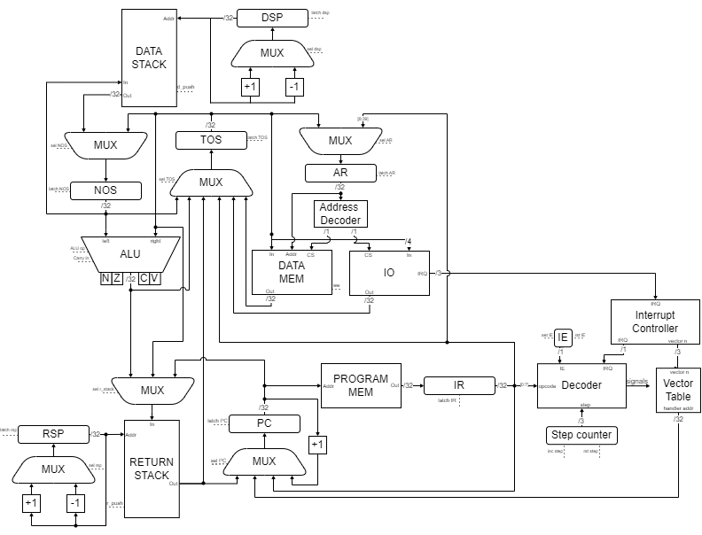

[](https://github.com/lysmux/csa-ak-4/actions/workflows/ci.yaml)

# Лабораторная работа №4

- **Студент:** Разыграев Кирилл Сергеевич
- **Группа:** 3215

```text
alg | stack | harv | hw | tick | binary | trap | mem | cstr | prob1 | superscalar
```

## Содержание

- [Вариант](#вариант)
- [Язык программирования](#язык-программирования)
  - [Синтаксис (BNF)](#синтаксис-bnf)
  - [Семантика](#семантика)
  - [Типы и литералы](#типы-и-литералы)
  - [Встроенные функции](#встроенные-функции)
- [Организация памяти](#организация-памяти)
- [Система команд](#система-команд)
  - [Формат инструкции и адресация](#формат-инструкции-и-адресация)
  - [Опкоды](#опкоды)
  - [Прерывания](#прерывания)
  - [Регистры и флаги](#регистры-и-флаги)
  - [Такты на цикл исполнения](#такты-на-цикл-исполнения)
- [Ввод-вывод](#ввод-вывод)
- [Конфигурация](#конфигурация)
- [Транслятор](#транслятор)
- [Модель процессора](#модель-процессора)
- [Тестирование](#тестирование)
- [Результаты](#результаты)

## Вариант

| Задание                              | Вариант       | Описание                                                                              |
|--------------------------------------|---------------|---------------------------------------------------------------------------------------|
| **Язык программирования. Синтаксис** | `alg`         | Синтаксис в духе java/javascript/lua; математические выражения; проверка AST в тестах |
| **Архитектура**                      | `stack`       | Стековая система команд (вместо регистров — стек)                                     |
| **Организация памяти**               | `harv`        | Гарвардская архитектура (раздельные память команд и данных)                           |
| **Control Unit**                     | `hw`          | Hardwired, реализован как часть модели                                                |
| **Точность модели**                  | `tick`        | Потактовое моделирование                                                              |
| **Представление машинного кода**     | `binary`      | Бинарное представление                                                                |
| **Ввод-вывод**                       | `trap`        | Ввод-вывод токенами через прерывания                                                  |
| **Ввод-вывод ISA**                   | `mem`         | Memory-mapped: устройства в адресном пространстве данных, доступ через `LOAD`/`STORE` |
| **Поддержка строк**                  | `cstr`        | Null-terminated (C string)                                                            |
| **Алгоритм**                         | `prob1`       | Largest Palindrome Product, [Project Euler #4](https://projecteuler.net/problem=4)    |
| **Усложнение**                       | `superscalar` | Суперскалярная организация (**не реализовано**)                                       |

[Подробное описание варианта](https://gitlab.se.ifmo.ru/computer-systems/csa-rolling/-/blob/master/lab4-task.md)

## Язык программирования

**Cube** — статически типизированный язык с C/JavaScript-подобным синтаксисом.
Исполнение начинается с функции `main`. Примеры — в каталоге [examples](examples)

```cube
fun main() {
    print("Hello, World!\n");
}
```

### Синтаксис (BNF)
```bnf
program        ::= { statement }

statement      ::= const_decl | var_decl | array_decl | fun_decl | interrupt_decl
                 | if_stmt | while_stmt | return_stmt
                 | assign_stmt | index_assign_stmt | expr_stmt | block

block          ::= "{" { statement } "}"

const_decl     ::= "const" identifier ":" type "=" expr ";"
var_decl       ::= "var" identifier ":" type "=" expr ";"
array_decl     ::= "var" identifier ":" type "[" number "]" ";"
fun_decl       ::= "fun" identifier "(" [ param_list ] ")" [ ":" type ] block
interrupt_decl ::= "interrupt" number identifier "(" ")" block

param_list     ::= param { "," param }
param          ::= type identifier

if_stmt        ::= "if" "(" [ expr ] ")" block [ "else" ( if_stmt | block ) ]
while_stmt     ::= "while" "(" expr ")" block
return_stmt    ::= "return" [ expr ] ";"
assign_stmt    ::= identifier "=" expr ";"
index_assign_stmt ::= identifier "[" expr "]" "=" expr ";"
expr_stmt      ::= expr ";"

expr           ::= or_expr
or_expr        ::= and_expr   { "||" and_expr }
and_expr       ::= xor_expr   { "&&" xor_expr }
xor_expr       ::= eq_expr    { "^"  eq_expr }
eq_expr        ::= rel_expr   { ( "==" | "!=" ) rel_expr }
rel_expr       ::= add_expr   { ( "<" | ">" | "<=" | ">=" ) add_expr }
add_expr       ::= mul_expr   { ( "+" | "-" ) mul_expr }
mul_expr       ::= unary_expr { ( "*" | "/" ) unary_expr }

unary_expr     ::= "!" unary_expr | "++" identifier | "--" identifier | postfix_expr
postfix_expr   ::= primary [ "++" | "--" ]
primary        ::= number | string | "true" | "false"
                 | call | index | identifier | "(" expr ")"
call           ::= identifier "(" [ arg_list ] ")"
index          ::= identifier "[" expr "]"
arg_list       ::= expr { "," expr }

type           ::= "int" | "long" | "bool" | "string"
identifier     ::= ( letter | "_" ) { letter | "_" }
number         ::= dec_number | hex_number
dec_number     ::= digit { digit }
hex_number     ::= ( "0x" | "0X" ) hex_digit { hex_digit }
string         ::= '"' { string_char | escape } '"'
escape         ::= "\n" | "\t" | "\r" | "\0" | "\\" | "\"" | "\'"
letter         ::= "a"…"z" | "A"…"Z"
digit          ::= "0"…"9"
hex_digit      ::= digit | "a"…"f" | "A"…"F"
comment        ::= "//" { любой символ, кроме перевода строки }
```

### Семантика
- **Стратегия вычислений** — аргументы выражений и вызовов **слева направо**, передача параметров — по значению.
- **Области видимости** — лексические, вложенные: глобальная → функция → её тело →
  блоки `if`/`while`. Внутренняя область может перекрывать имена внешней.
- **Типизация** — статическая, проверяется анализатором; `int` неявно расширяется до `long`
- **Точка входа** — функция `main` (обязательна)

## Приоритет операторов
От низшего к высшему:
```text
|| < && < ^ < == != < < > <= >= < + - < * / < ! ++ -- < ++ --
```
* Все бинарные операторы левоассоциативны
* `&&`, `||`, `^`, `!` работают только с `bool`
* `++` и `--` применимы только к изменяемым числовым переменным


### Типы и литералы

| Тип      | Описание                    | Хранение                             |
|----------|-----------------------------|--------------------------------------|
| `int`    | 32-битное знаковое          | 1 слово (4 байта)                    |
| `long`   | 64-битное знаковое          | 2 слова (lo@`addr`, hi@`addr+4`)     |
| `bool`   | `true` / `false`            | 1 слово (`1` / `0`)                  |
| `string` | cstr (нуль-терминированная) | в памяти данных; только в `print`    |
| `T[N]`   | массив                      | `N` слов; элементы 32-битные (`int`) |

Литералы: целочисленные (`42`, `0xFF`), строковые (`"...\n"` с escape), `true`/`false`.

### Встроенные функции

| Функция              | Сигнатура                 | Описание                                                                                                 |
|----------------------|---------------------------|----------------------------------------------------------------------------------------------------------|
| `print`              | `print([label,] ...args)` | Вывод на устройство (метка или `default`). Печатаемые типы: `string`, `int`, `long`, `bool`              |
| `read`               | `read()` \| `read(label)` | Чтение байта (→ `int`). Без метки — только в обработчике прерывания (устройство определяется по вектору) |
| `enable_interrupts`  | `enable_interrupts()`     | Разрешить прерывания (`EI`)                                                                              |
| `disable_interrupts` | `disable_interrupts()`    | Запретить прерывания (`DI`)                                                                              |

## Организация памяти

- **Архитектура** — Гарвардская: раздельные память команд и память данных.
- **Машинное слово** — 32 бита (4 байта), порядок байт little-endian.
- **Адресация** — байтовая. Слово данных читается/пишется как срез из 4 байт по
  байтовому адресу; инструкция занимает строку в 5 байт (40 бит).

```text
           Память команд                               Память данных
+-------------------------------------+    +-------------------------------------+
| 0x0000 : CALL main                  |    | константы                           |
| 0x0005 : HALT                       |    | строки (cstr: 1 символ = 1 слово)   |
| ...    : тело функции 1 (JMP-skip)  |    | переменные                          |
| ...    : тело обработчика прерывания|    | массивы (N слов)                    |
| ...    : тело main                  |    | ...                                 |
+-------------------------------------+    | 0x0222 : MMIO-устройства (high)     |
                                           +-------------------------------------+
```

```text
 Таблица векторов прерываний
+----------------------------+
| вектор : адрес обработчика |
| ...    : ...               |
+----------------------------+
```

**Работа с объектами при компиляции:**

| Объект         | Размещение                                                                                                                               |
|----------------|------------------------------------------------------------------------------------------------------------------------------------------|
| **Литералы**   | Малые целые — непосредственная адресация (`PUSH operand`). Строки — cstr в памяти данных. `long` — два слова (`lo`@addr, `hi`@addr+4)    |
| **Константы**  | Если статически вычислимы (`_static_eval`) — значение свёртывается и используется как immediate (`PUSH`); иначе хранится в памяти данных |
| **Переменные** | Все переменные и массивы — в **памяти данных**; адрес назначается при компиляции                                                         |
| **Инструкции** | Память команд; вход — `CALL main`, затем `HALT`; тела функций/обработчиков идут следом                                                   |
| **Процедуры**  | Вызов — `CALL addr`, возврат — `RET` через стек возвратов; параметры через стек данных                                                   |
| **Прерывания** | Обработчик компилируется как процедура с `RTI`; адрес записывается в `vector_table[вектор]`                                              |

## Система команд

### Формат инструкции
Инструкция — **40 бит**:
- **опкод** — 1 байт (старший);
- **операнд** — 4 байта (32 бита, беззнаковый): непосредственное значение либо байтовый адрес

### Опкоды

**Системные**

| Hex | Мнемоника | Псевдокод | Описание     |
|-----|-----------|-----------|--------------|
| 01  | NOP       | —         | Нет операции |
| 02  | HALT      | stop      | Остановка    |

**Стек** (обозначение: `TOS:NOS:[]`)

| Hex | Мнемоника | Операнд | Стек ДО  | Стек После | Псевдокод | Флаги |
|-----|-----------|---------|----------|------------|-----------|-------|
| 10  | PUSH      | imm     | `:[]`    | `a:[]`     | TOS ← imm | N Z   |
| 11  | DUP       | —       | `a:[]`   | `a:a:[]`   | push TOS  | N Z C |
| 12  | DROP      | —       | `a:[]`   | `:[]`      | pop       | N Z   |
| 13  | SWAP      | —       | `a:b:[]` | `b:a:[]`   | TOS ↔ NOS | N Z   |
| 14  | OVER      | —       | `a:b:[]` | `b:a:b:[]` | push NOS  | N Z   |

**Память**

| Hex | Мнемоника | Операнд | Стек ДО  | Стек После | Псевдокод          | Описание                                   |
|-----|-----------|---------|----------|------------|--------------------|--------------------------------------------|
| 20  | LOAD      | addr    | `:[]`    | `a:[]`     | TOS ← M[addr]      | Прямая загрузка                            |
| 21  | STORE     | addr    | `a:[]`   | `:[]`      | M[addr] ← TOS; pop | Прямая запись                              |
| 22  | LOADI     | —       | `a:[]`   | `b:[]`     | TOS ← M[TOS]       | Косвенная загрузка (адрес с TOS)           |
| 23  | STOREI    | —       | `a:b:[]` | `:[]`      | M[TOS] ← NOS       | Косвенная запись (адрес TOS, значение NOS) |

**Арифметика**

| Hex | Мнемоника | Стек ДО  | Стек После | Псевдокод           | Флаги   |
|-----|-----------|----------|------------|---------------------|---------|
| 30  | ADD       | `a:b:[]` | `b+a:[]`   | TOS ← NOS + TOS     | N Z V C |
| 31  | SUB       | `a:b:[]` | `b-a:[]`   | TOS ← NOS − TOS     | N Z V C |
| 32  | MUL       | `a:b:[]` | `b*a:[]`   | TOS ← NOS × TOS     | N Z V C |
| 33  | DIV       | `a:b:[]` | `b/a:[]`   | TOS ← NOS / TOS     | N Z V C |
| 34  | CMP       | `a:b:[]` | `a:b:[]`   | FLAGS ← NOS − TOS   | N Z V C |
| 35  | INC       | `a:[]`   | `a+1:[]`   | TOS ← TOS + 1       | N Z V C |
| 36  | DEC       | `a:[]`   | `a-1:[]`   | TOS ← TOS − 1       | N Z V C |
| 37  | NEG       | `a:[]`   | `-a:[]`    | TOS ← −TOS          | N Z V C |
| 38  | ADDC      | `a:b:[]` | `b+a+C:[]` | TOS ← NOS + TOS + C | N Z V C |

**Двойная точность (long, 64 бита)** Операнд - `long` — две ячейки (`TOS`=старшее, `NOS`=младшее).
Двусловная операция снимает два операнда (4 ячейки: верхний `B`, нижний `A`) и кладёт один результат (2 ячейки)

| Hex | Мнемоника | Стек ДО          | Стек После | Псевдокод        | Флаги   |
|-----|-----------|------------------|------------|------------------|---------|
| 39  | DADD      | `Bh:Bl:Ah:Al:[]` | `Rh:Rl:[]` | R ← A + B        | N Z V C |
| 3A  | DSUB      | `Bh:Bl:Ah:Al:[]` | `Rh:Rl:[]` | R ← A − B        | N Z V C |
| 3B  | DMUL      | `Bh:Bl:Ah:Al:[]` | `Rh:Rl:[]` | R ← A × B        | N Z V C |
| 3C  | DDIV      | `Bh:Bl:Ah:Al:[]` | `Rh:Rl:[]` | R ← A / B        | N Z V C |
| 3D  | I2L       | `a:[]`           | `hi:a:[]`  | push sign-ext(a) | —       |

**Логические**

| Hex | Мнемоника | Стек ДО  | Стек После | Псевдокод        | Флаги |
|-----|-----------|----------|------------|------------------|-------|
| 40  | AND       | `a:b:[]` | `a&b:[]`   | TOS ← NOS & TOS  | N Z   |
| 41  | OR        | `a:b:[]` | `a\|b:[]`  | TOS ← NOS \| TOS | N Z   |
| 42  | XOR       | `a:b:[]` | `a^b:[]`   | TOS ← NOS ^ TOS  | N Z   |
| 43  | NOT       | `a:[]`   | `~a:[]`    | TOS ← ~TOS       | N Z   |
| 44  | SHL       | `a:[]`   | `a<<1:[]`  | TOS ← TOS << 1   | N Z C |
| 45  | SHR       | `a:[]`   | `a>>1:[]`  | TOS ← TOS >> 1   | N Z C |

**Условные переходы** (операнд — адрес)

| Hex | Мнемоника | Условие   | Псевдокод                |
|-----|-----------|-----------|--------------------------|
| 50  | JZ        | = 0       | if Z: PC ← addr          |
| 51  | JNZ       | ≠ 0       | if ¬Z: PC ← addr         |
| 52  | JPL       | N = 0     | if ¬N: PC ← addr         |
| 53  | JMI       | N = 1     | if N: PC ← addr          |
| 54  | JGE       | ≥ (знак.) | if N = V: PC ← addr      |
| 55  | JL        | < (знак.) | if N ≠ V: PC ← addr      |
| 56  | JG        | > (знак.) | if ¬Z ∧ N = V: PC ← addr |
| 57  | JLE       | ≤ (знак.) | if Z ∨ N ≠ V: PC ← addr  |
| 58  | JC        | C = 1     | if C: PC ← addr          |
| 59  | JNC       | C = 0     | if ¬C: PC ← addr         |
| 5A  | JV        | V = 1     | if V: PC ← addr          |
| 5B  | JNV       | V = 0     | if ¬V: PC ← addr         |

**Управление потоком**

| Hex | Мнемоника | Операнд | Псевдокод                                |
|-----|-----------|---------|------------------------------------------|
| 60  | JMP       | addr    | PC ← addr                                |
| 61  | CALL      | addr    | M_R[RSP] ← PC; RSP++;  PC ← addr         |
| 62  | RET       | —       | RSP−−; PC ← M_R[RSP];                    |
| 63  | LOOP      | addr    | M_R[RSP]−−; if ≠ 0: PC ← addr else RSP-- |
| 64  | PSHR      | —       | M_R[RSP] ← TOS; RSP++; pop               |
| 65  | POPR      | —       | RSP−−; push M_R[RSP]                     |

**Прерывания**

| Hex | Мнемоника | Псевдокод                        |
|-----|-----------|----------------------------------|
| 70  | EI        | PS.IE ← 1                        |
| 71  | DI        | PS.IE ← 0                        |
| 72  | RTI       | PC ← pop; FLAGS ← pop; PS.IE ← 1 |

### Прерывания

При установленном `IE` и сигнале `IRQ` от устройства, после завершения текущей
инструкции CU аппаратно выполняет:

```text
M_R[RSP] ← FLAGS; RSP ← RSP − 1
M_R[RSP] ← PC;    RSP ← RSP − 1
PS.IE ← 0          # вложенные прерывания запрещены
PS.IRQ ← 0
PC ← vector_table[N]
```

Обработчик объявляется как `interrupt N name() { ... }`, компилируется как процедура
с `RTI`. Возврат `RTI` восстанавливает `PC`/`FLAGS` и снова разрешает прерывания.

### Регистры и флаги

| Имя         | Назначение                                                           |
|-------------|----------------------------------------------------------------------|
| `PC`        | Счётчик команд (байтовый адрес в памяти команд)                      |
| `IR`        | Регистр текущей исполняемой инструкции                               |
| `IE`        | Разрешение прерываний                                                |
| `AR`        | Адресный регистр памяти данных                                       |
| `TOS`/`NOS` | Вершина и второй элемент стека данных                                |
| `SP`/`RSP`  | Указатели стека данных / возвратов                                   |
| `FLAGS`     | `N` (знак), `Z` (ноль), `V` (знак. переполнение), `C` (перенос/заём) |

### Такты на цикл исполнения

Полный цикл = `START` + `FETCH` + `EXECUTE`(N шагов) = **N + 2 такта**.

| Такты | Инструкции                                                                                                               |
|-------|--------------------------------------------------------------------------------------------------------------------------|
| 4     | `NOP` `PUSH` `DUP` `SWAP` `OVER` `EI` `DI` `CMP` `I2L` `INC` `DEC` `NEG` `NOT` `SHL` `SHR` `JMP` и все условные переходы |
| 5     | `LOAD` `CALL` `RET` `DROP` `PSHR` `POPR` `ADD` `SUB` `MUL` `DIV` `ADDC`                                                  |
| 6     | `STORE` `LOADI` `LOOP`                                                                                                   |
| 7     | `STOREI`                                                                                                                 |
| 8     | `RTI` `DMUL` `DDIV`                                                                                                      |
| 9     | `DADD` `DSUB`                                                                                                            |

## Ввод-вывод
Отдельных IO-инструкций нет, устройства отображены в адресное пространство памяти данных и доступны через `LOAD`/`STORE`.

**Устройства вывода (`Output`):
** `STORE value, addr` добавляет `value` в буфер
устройства. `print` без метки пишет на устройство `default`.
Рендеринг буфера:
* `format: string` — байты как символы;
* `format: raw` — числа через пробел;

**Устройства ввода (`Input`):
** ввод управляется прерываниями. На каждом такте защёлкивает запланированный байт на порт и, пока байт не прочитан,
удерживает запрос прерывания (`vector`). `read()` (через `LOAD addr`) возвращает байт
и сбрасывает порт; чтение пустого порта даёт `0`.

> При `trap`-вводе слишком частые токены относительно длительности обработчика приводят
> к перезаписи порта

```cube
interrupt 0 on_char() {
    var c: int = read();
    if (c == 0) { done = true; } else { print(c); }
}
```

## Конфигурация
Параметры машины задаются YAML-файлом (`-c/--config`).

```yaml
limit: 10000              # предел тактов симуляции

memory_size:             # размеры памятей, в байтах
  instruction: 2000      # инструкция занимает 5 байт
  data: 1000             # слово данных — 4 байта

stack_size:              # глубины стеков, в записях
  ret: 1000
  data: 1000

io:
  outputs:
    default:             # метка устройства
      format: string     # string | raw
      address: 0x222     # байтовый MMIO-адрес
      default: true      # устройство для print без метки
  inputs:
    keyboard:
      address: 0x223
      vector: 0          # вектор прерывания, 0..7
      schedule:          # [такт, значение]: байт 0..255 или символ
        - [1, h]
        - [100, e]
        - [200, l]
        - [250, l]
        - [1000, o]
```

**Проверки при загрузке:** не более одного `default`-вывода; уникальность адресов
устройств; в расписании `tick ≥ 1`, без дублей тактов, строковое значение — один
символ, `tick ≤ limit`; вектор в диапазоне `0..7`.

## Транслятор
```text
uv run python -m app.cli compile <source.cube> <target.bin> -c <config.yaml> [--debug <out.dbg>]
```

- *Вход:* исходный файл `.cube`, конфигурация (`-c`).
- *Выход:* бинарный машинный код (`target.bin`) и текстовый отладочный дамп (`.dbg`).

**Этапы:**
1. **Лексер** (`lexer.py`) — поток токенов; десятичные/шестнадцатеричные числа, строки с escape, комментарии `//`.
2. **Парсер** (`parser.py`) — AST; выражения разбираются по приоритетам (алгоритм Пратта).
3. **Анализатор** (`analyzer.py`) — проверка типов, областей видимости, корректности встроенных вызовов и обработчиков прерываний.
4. **Кодогенератор** (`codegen.py`) — `CompiledProgram`: список инструкций, сегмент данных и таблица векторов прерываний.

**Компоновка бинарника:** `CALL main; HALT;` затем тела функций/обработчиков.

**Соглашение о вызовах:**
* Аргументы вычисляются слева направо и кладутся на стек данных
* Пролог функции снимает их в обратном порядке
* Возвращаемое значение — на стеке перед `RET``.

## Модель процессора
```text
uv run python -m app.cli run <program.bin> -c <config.yaml> [--trace]
```

- *Вход:* бинарный машинный код; данные ввода задаются **расписанием** в конфигурации
  (`io.inputs[].schedule`) — отдельного файла ввода нет, ввод управляется прерываниями.
- *Выход:* результат (буферы выходных устройств) и журнал состояний (`--trace`).

**Журнал работы** (по такту):
```text
tick:     25 │ state: FETCH      │    pc: 0x0041 │    ir: I2L      0x00000000 │ flags: · · · · │   tos: 0x00000000 │   nos: 0x00000010 │  rtos: 0x00000005
tick:     26 │ state: EXECUTE    │    pc: 0x0046 │    ir: DADD     0x00000000 │ flags: · · · · │   tos: 0x00000000 │   nos: 0x00000010 │  rtos: 0x00000005
tick:     27 │ state: EXECUTE    │    pc: 0x0046 │    ir: DADD     0x00000000 │ flags: · · · · │   tos: 0x00000010 │   nos: 0x00000010 │  rtos: 0x00000005
```

### Схема
Совмещённая схема DataPath и ControlUnit:



### Особенности моделирования

- Потактовая точность: на каждом такте обрабатывается одно состояние управляющего автомата; моделирование можно приостановить на любом такте.
- Стек данных — регистровая модель (`TOS`/`NOS` + синхронная стек-память): чтение стека — 2 такта, запись — 1 такт.
- Память — байтоадресуемая, доступ словом — срезом из 4 байт little-endian.

## Тестирование
- **Golden-тесты** (`tests/golden/`): для каждого алгоритма фиксируются исходный код,
  конфигурация, ожидаемый вывод, AST, машинный код и журнал работы.
- **Инструменты качества:** `ruff` (линт + формат), `mypy` (строгая типизация) — в CI.

| Алгоритм          | Описание                                       | Файл                                                    |
|-------------------|------------------------------------------------|---------------------------------------------------------|
| `hello`           | Печать "Hello, World!"                         | [hello.yaml](tests/yaml/hello.yaml)                     |
| `cat`             | Эхо ввода с остановкой по символу `0`          | [cat.yaml](tests/yaml/cat.yaml)                         |
| `hello_user_name` | Запрос имени и приветствие                     | [hello_user_name.yaml](tests/yaml/hello_user_name.yaml) |
| `sort`            | Сортировка введённого списка чисел             | [sort.yaml](tests/yaml/sort.yaml)                       |
| `long_arithmetic` | Арифметика двойной точности (64 бита)          | [long_arithmetic.yaml](tests/yaml/long_arithmetic.yaml) |
| `palindrome`      | Алгоритм варианта — Largest Palindrome Product | [palindrome.yaml](tests/yaml/palindrome.yaml)           |
| `algorithms`      | Доп. демо: рекурсия, циклы, `++`               | [algorithms.yaml](tests/yaml/algorithms.yaml)           |

**Пример использования:**
```console
$ uv run python -m app.cli compile examples/hello.cube hello.bin -c config.yaml --debug hello.dbg
Compiled
    examples/hello.cube -> hello.bin
Debug
    hello.dbg

$ uv run python -m app.cli run hello.bin -c config.yaml
Output
    default │ Hello
Summary
    stop reason: │ halt
    ticks:       │ 512
```

## Результаты
| Алгоритм          | LoC | Кол-во инструкций | Размер байт кода | Такты     |
|-------------------|-----|-------------------|------------------|-----------|
| `hello`           | 3   | 16                | 80               | 512       |
| `cat`             | 14  | 52                | 260              | 665       |
| `hello_user_name` | 25  | 129               | 645              | 3004      |
| `sort`            | 39  | 201               | 1005             | 7438      |
| `long_arithmetic` | 11  | 60                | 300              | 311       |
| `palindrome`      | 30  | 140               | 700              | 1 440 762 |
| `algorithms`      | 25  | 109               | 545              | 1447      |
